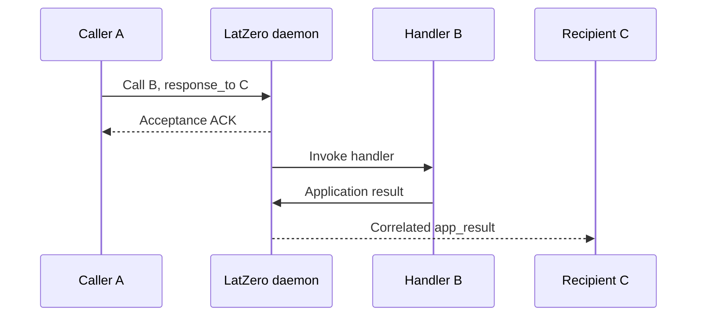
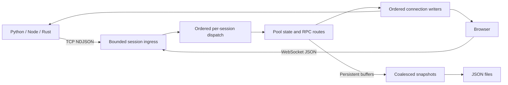

# LatZero

**Let your local apps share state and call each other without each one becoming a server.**


A Python worker, a Node application, a Rust service, and a browser dashboard should not need four different integration stories just to communicate on the same machine.

LatZero gives them one local coordination daemon. Clients join a named **pool**, share JSON values, subscribe to changes, discover peers, and invoke handlers hosted by other clients. The daemon handles routing, correlation, expiry, and optional snapshots. Your application code stays in your application.

The interesting part is not another way to send bytes down a socket. It is everything you no longer have to build around that socket.

## Why This Exists

Splitting an application into cooperating processes is easy enough. Making those processes cooperate is where the plumbing starts.

Shared memory can move data, but it does not give a browser a connection or turn a Python function into a callable endpoint for Node. Direct sockets leave you implementing framing, discovery, request IDs, timeouts, and slow-peer handling. Giving every helper an HTTP server means managing an endpoint for every helper.

LatZero puts that coordination in one place.

A client identifies itself, joins a pool, and publishes state or handlers. Other clients address names instead of managing a separate connection to every participant. A caller can even ask one client to execute work and another to receive the result.

This is a deliberately local model: **one daemon, several runtimes, shared names, explicit boundaries**. Not a distributed platform disguised as a weekend dependency.

Despite the name, latency is not zero. Neither is the amount of coordination code this saves you.

## What You Can Do

| Capability | What it buys you |
|---|---|
| Pool-scoped buffers | Share JSON state without embedding storage and discovery in every client. |
| Buffer subscriptions | Observe changes instead of polling continuously. |
| Application RPC | Invoke an event handler on a specific connected client. |
| Registered processes | Publish named callable handlers such as `calculator:add`. |
| Short-name routing | Route calls among registrations sharing a process name using round-robin selection. |
| Third-party replies | Have A call B while C receives the correlated result. |
| TTL and selective persistence | Keep temporary state temporary and snapshot the values that matter. |
| Bounded admission and output | Receive an explicit overload error or connection failure instead of silent frame loss. |
| Optional terminal dashboard | Inspect daemon activity without making a dashboard a runtime requirement. |

A registered **process** is a client-hosted handler, not an operating-system process that the daemon launches.

## Try It

The quickest path uses the Python daemon and the dependency-free Node client.

These instructions assume the sibling directories in this workspace are present. Local installs use the inspected source rather than assuming a registry release contains the same implementation.

### 1. Start the Daemon

Use an isolated Python environment. The daemon declares Python **3.8+** and installs `websockets` as its runtime dependency.

From the workspace root:

```bash
python -m pip install ./latzero-server
latzero-server --headless --no-ws
```

This starts TCP on `127.0.0.1:14130`. Keep this terminal running.

`--headless` is the default; it is explicit here for clarity. `--no-ws` disables the browser listener for this first example.

### Pool-Affine Pods

For multiple independent pools, start a local supervisor and four daemon processes:

```bash
latzero-server --headless --pods 4
```

The public TCP port remains `14130` and the optional WS entry port remains
`14131`. The supervisor accepts `hello`/`join_pool` and redirects the connection
to the pool's owner. Every connection for the exact same pool name uses the same
owner: `int.from_bytes(SHA256(pool.encode('utf-8')).digest(), 'big') % pods`.
Steady-state data goes directly to the selected pod, not through a proxy or a
cross-pod forwarding layer. Internal pod listeners bind loopback ephemeral ports.
SDKs connect through the public entry point; do not persist internal pod ports as
application configuration.

Use redirect-capable versions of all Python, Node, browser and Rust SDKs. They
advertise `pool_redirect_v1`, validate local owner endpoints, bound redirect hops,
and keep one connection deadline across the initial join. Older clients receive
`redirect_required` rather than an incorrect isolated pool or a silent timeout.
The feature is loopback-only; it does not authorize remote clients, add TLS, or
provide a multi-machine cluster. The original `--pods 1` single-daemon path and
wire operations remain supported.

| Pod Boundary | Behavior |
| --- | --- |
| One pool | Exactly one owner process; buffers, handlers, subscriptions and routes stay together |
| One hot pool | Still one event-loop CPU domain; more pods do not split it |
| Many pools | Can execute in parallel across pod processes; skew/collisions and workload affect gains |
| Pool switch | May replace the transport; old-pool work/registrations are quiesced, never replayed |
| Failure | Unexpected pod departure makes the cluster unhealthy and fails closed; no live remap/failover |
| Pod count | Fixed during a run; changing it requires full graceful stop/restart |
| State directory | Existing exact-identity snapshot files stay in one directory; each pod loads/writes only its owned pools |
| Persistent data | Remains eventual snapshot state; changing pod count does not make ACKs crash-durable |
| Dashboard | `--tui` is supported only by the single-daemon path in this release |

A cross-platform directory lock rejects a second live daemon/supervisor writing
the same state directory. Child ownership locks remain held through shutdown and
file I/O, including parent-loss teardown. Legacy snapshots are preserved, not
rewritten into per-pod folders. Back up persistent state before changing binaries
or pod count, and stop all owners before restarting. Limits such as route/queue
budgets apply per pod, with separate bounded admission at the public router.

Browser pages need their explicit Origin permitted by the entry router and pods
using the existing `--ws-origin` flag; redirecting the WS endpoint does not change
the page Origin. File-page `null` remains an explicit opt-in. Pod scaling is
validated with multiple pools, not inferred from the earlier single-pool mesh.

### 2. Connect Two Clients

The Node SDK documents Node **18+**; its package has no external dependencies or build step.

Example application, `demo.cjs`, run from the workspace root:

```javascript
const LatZeroClient = require('./node-client/index.cjs');

const worker = new LatZeroClient(
  'latzero://calculator',
  'readme-demo',
  { autoConnect: false }
);

const caller = new LatZeroClient(
  'latzero://node-app',
  'readme-demo',
  { autoConnect: false }
);

async function main() {
  try {
    await Promise.all([worker.connect(), caller.connect()]);

    await worker.process.register(({ a, b }) => a + b, 'add');

    await caller.set(
      'job:42',
      { status: 'queued' },
      { autoClean: 30000 }
    );

    // The value belongs to the pool, not to the client that wrote it.
    console.log(await worker.get('job:42'));

    const reply = await caller.process.call(
      'calculator:add',
      { a: 20, b: 22 }
    );

    // Application errors are carried in the result envelope.
    if (reply.payload.error != null) {
      throw new Error(JSON.stringify(reply.payload.error));
    }

    console.log(reply.payload.value);
  } finally {
    caller.disconnect();
    worker.disconnect();
  }
}

main().catch(error => {
  console.error(error);
  process.exitCode = 1;
});
```

Run it:

```bash
node demo.cjs
```

Expected output:

```text
{ status: 'queued' }
42
```

The shared-buffer and process-call sequence has been checked against a real daemon using an isolated port and temporary storage. The two clients are in one script for convenience; they can live in separate applications.

For an application dependency rather than a source-relative import:

```bash
npm install ./node-client
```

Then use `require('latzero')` or the ESM default import.

## The Mental Model

Four names explain most of the system:

| Term | Meaning |
|---|---|
| **Client** | A connected application identity, such as `calculator`. |
| **Pool** | The scope containing clients, buffers, subscriptions, and registrations. |
| **Buffer** | A named JSON value with version metadata and optional TTL/persistence. |
| **Process** | A named callable handler registered by a client. |

In the example, `latzero://calculator` supplies the client identity. The separate argument `readme-demo` selects the pool. Host and port are connection options.

Two clients must join the same pool to communicate. Identical buffer keys in different pools are separate state.

The first join creates a pool. Supplying a nonempty authentication token when creating it makes subsequent joins require that token. This is shared-token membership, not per-operation authorization.

### State and Notifications

Using the connected Node clients from the example:

```javascript
worker.on('bufferUpdate', update => {
  console.log(update.key, update.entry?.value);
});

await worker.subscribe('job:42');
await caller.set('job:42', { status: 'running' });

console.log(await caller.keys('job:'));
```

Key filtering uses a **literal prefix**. `job:` matches; `job:*` is not a glob.

For snapshot-backed state:

```javascript
await caller.set(
  'settings',
  { theme: 'dark' },
  { persistent: true }
);
```

JavaScript `autoClean` values are **milliseconds**. Python TTLs and wire-protocol TTLs are **seconds**. Rust uses `Duration`.

Subscriptions are live notifications, not a replay log. After a disconnection, reconnect and re-read the state you depend on.

### Calls and Results Are Different Events

A normal process call returns the terminal result to its caller. With `responseTo`, it returns acceptance metadata instead, and the designated recipient observes `app_result`.



In the Node SDK:

```javascript
recipient.on('app_result', message => {
  console.log(message.payload.request_id, message.payload.value);
});

const accepted = await caller.process.call(
  'calculator:add',
  { a: 20, b: 22 },
  { responseTo: recipient.clientId }
);
```

All three clients must already be connected to the same pool.

Acceptance means admission into the bounded delivery path. It does **not** mean the handler finished. A timeout after transmission does not prove the handler did nothing.

Process broadcasts similarly acknowledge accepted targets and generate independent child results. They are not an aggregate-result API or an atomic operation.

## Pick Your Client

| Client | Transport | Execution model | Starting point |
|---|---|---|---|
| [Node](node-client/README.md) | TCP | Handlers on the Node event loop; ESM and CommonJS | `LatZeroClient` / `LatZeroAsyncClient` |
| [Python](python-client/README.md) | TCP | Synchronous connection; bounded threaded callbacks/workers | `LatZero` |
| [Rust](rust-client/README.md) | TCP | Tokio-based async client and handlers | `Client` |
| [Browser](web-client/README.md) | WebSocket | Plain script; handlers on the browser main thread | `LatZeroWebClient` |

The common currency is JSON-compatible data, not arbitrary language objects. Use object-shaped arguments for calls.

Return conventions differ: JavaScript RPCs return response envelopes; Python and Rust convenience APIs return handler values and surface application errors through their error APIs.

### Python

Install the local package:

```bash
python -m pip install ./python-client
```

With the daemon running:

```python
from latzero import LatZero

with LatZero("latzero://python-worker", "readme-demo") as worker, \
     LatZero("latzero://python-app", "readme-demo") as caller:

    @worker.process.register(name="add")
    def add(a, b):
        return a + b

    caller.set("job:42", {"status": "queued"}, auto_clean=30)
    print(caller.process.call("python-worker:add", a=20, b=22))
```

The Python package also contains a **separate standalone shared-memory API**, `SharedMemoryPool`. That is not the transport used by the daemon SDKs, and Node/Rust/browser clients do not attach to those memory segments.

The package currently installs and eagerly imports shared-memory dependencies, including `cryptography`, even for daemon use. A platform without a compatible wheel may need native build prerequisites.

`AsyncLatZero` is an executor-backed facade, not a fully native async replacement. Python worker modes currently use threads, including modes named `PROCESS` and `ADAPTIVE`.

### Rust

The crate declares Rust **1.85+** and edition 2024. Its included example demonstrates buffers, application RPC, and process RPC:

```bash
cargo run --locked --manifest-path rust-client/Cargo.toml --example server_mode
```

See the [Rust README](rust-client/README.md) for typed results, builder limits, registration options, and third-party `CallOutcome` handling.

Rust event receivers use bounded Tokio broadcast channels. Handle `RecvError::Lagged`; a local receiver falling behind is not the same thing as daemon delivery failure.

### Browser Demo

Stop the earlier TCP-only daemon, then restart with an explicitly permitted browser origin:

```bash
latzero-server --headless --ws-origin http://127.0.0.1:8080
```

In another terminal:

```bash
python -m http.server 8080 --bind 127.0.0.1 --directory web-client
```

Open [http://127.0.0.1:8080](http://127.0.0.1:8080).

The included page exercises buffers, events, and process registration. It is a local demonstration, not a hardened administrative interface.

Origin matching is exact: `localhost` and `127.0.0.1` are different origins. File pages require explicit `--ws-origin null`. The browser SDK derives its WebSocket port from TCP port + 1 and currently uses `ws://`, not `wss://`.

## How It Works



TCP carries newline-delimited JSON. WebSocket carries one JSON object per text message. Both feed the same protocol and pool operations.

Each session has a bounded FIFO and at most one active dispatcher. An autoscaling pool of asyncio tasks serves ready sessions in bounded slices. Each connection has one ordered writer with a finite deadline and reserved control capacity.

Those **dispatch workers are asyncio tasks**, not extra CPU cores. Handler execution remains client-side; increasing the daemon's worker ceiling does not make its Python routing and JSON processing multicore.

RPC routing uses opaque internal hop IDs and verifies the designated callee before accepting a result. Public results preserve the original caller correlation. This prevents route confusion without claiming durable exactly-once execution.

Persistence captures owned snapshots before executor-backed disk I/O. Only persistent buffers and pool authentication metadata survive; connections, subscriptions, process registrations, and in-flight calls do not.

## Guarantees, Without the Fine-Print Acrobatics

- **Overload is explicit.** Work is rejected before acceptance or a slow connection fails; output is not knowingly skipped and reported as delivered.
- **Buffer ACKs confirm in-memory state commitment.** They do not confirm every subscriber observed the update.
- **Persistence is eventual.** Snapshot replacement and graceful flushing are not a WAL or crash-safe write ACK.
- **Notifications have no replay.** Reconnection requires restoring subscriptions and reading current state.
- **Timeouts leave effects uncertain.** Do not blindly retry effectful RPCs or partially accepted broadcasts.
- **Client batches are not transactions.** Read-modify-write helpers are not atomic distributed operations.
- **The daemon is single-instance state.** Multiple daemons do not share membership, buffers, or routes.
- **Local does not mean authenticated.** Loopback and browser Origin checks are useful boundaries, not protection against a malicious local process.

There is no built-in TLS, replication, failover, or durable job execution. Pool snapshots are plaintext JSON. Keep the daemon on loopback unless you provide and evaluate the surrounding security yourself.

## Configuration

The CLI exposes listener, storage, dashboard, and basic worker settings. Detailed protective budgets live in [`ServerConfig`](latzero-server/latzero_server/config.py); there is no configuration-file or environment-variable loader.

| Setting | Default | Configure With |
|---|---|---|
| Bind address | `127.0.0.1` | `--host` |
| TCP port | `14130` | `--port` |
| WebSocket port | TCP port + 1 | `--ws-port` |
| WebSocket listener | Enabled | `--no-ws` to disable |
| Browser origins | None allowed; Origin-less clients allowed | Repeatable `--ws-origin` |
| Snapshot directory | `~/.cache/latzero` | `--data-dir` |
| Dashboard | Off | `--tui` |
| Connection budget | `5000` | `--max-connections` |
| Dispatch task range | `4`–`512` | `--min-workers`, `--max-workers` |
| Application frame limit | `1 MiB` | `max_frame_bytes` |
| Session ingress budget | `256` messages / `1 MiB` | `max_session_messages`, `max_session_bytes` |
| Outstanding routes per session | `256` | `max_routes_per_session` |
| Default daemon RPC deadline | `30 seconds` | `rpc_timeout` |
| Snapshot batching window | `0.1 seconds` | `persistence_batch_window` |

These are protective defaults, not measured capacity promises. Frame and state counters are not exact process-memory accounting.

For the optional dashboard:

```bash
python -m pip install "./latzero-server[tui]"
latzero-server --tui
```

Stop the daemon with Ctrl+C.

## Performance: Measured, Not Named Into Existence

The [independent-process report](benchmarks/Report.md) records **300 completed measured runs**, including raw protocol tests, Python/Node/Rust SDK calls, TCP/HTTP comparisons, and overload recovery.

Selected original three-second RPC results at 64 outstanding requests:

| Caller | Median Terminal Results/s | Successful-Reply p99 |
|---|---:|---:|
| Raw protocol | 4,877 | 36.86 ms |
| Node | 4,864 | 36.46 ms |
| Rust | 4,677 | 37.19 ms |
| Python | 4,377 | 37.48 ms |

The environment was Windows 11 ARM64, a 12-core Qualcomm CPU, Python 3.12.8, Node 26.5.1, and Rust 1.97.1. Each point had three repetitions, a separate daemon and caller/handler processes, and validated terminal responses rather than ACK counts.

These are short-run, shared-host results. Longer confirmations varied materially; the report separates them rather than presenting the best number as sustained capacity. Successful-response percentiles do not cover failed or rejected attempts.

Two particularly useful correctness observations:

- A 30-process Python/Node/Rust network exercised 90 A-to-B-to-C routes. Its conservative 150-offers/s runs completed all 2,250 requests across three repetitions without rejection.
- Deliberate route pressure produced 6,116 explicit daemon rejections. Every accepted call completed, and normal traffic recovered on the same daemon.

That supports the tested workloads, not a universal SLO or exactly-once guarantee after arbitrary failures. Raw evidence, methodology, clock-skew issues, censored runs, and reproduction prerequisites are in the report.

## Repository Map

This workspace contains separately maintained server and client repositories.

```text
latency_zero/
├── latzero-server/   # Protocol, pool state, routing, persistence, and dashboard
├── node-client/      # Dependency-free ESM/CommonJS TCP SDK
├── python-client/    # TCP SDK plus a separate standalone shared-memory system
├── rust-client/      # Typed Tokio TCP SDK and runnable examples
├── web-client/       # Browser script, interactive demo, and mock tests
└── benchmarks/       # Independent-process harnesses, report, and raw evidence
```

## Development and Contributions

Run commands from the indicated component directory.

| Component | Setup and Checks |
|---|---|
| Server | `python -m pip install -e . pytest pytest-asyncio`, then `python -m pytest tests` |
| Node | `npm test` |
| Browser script | `node --unhandled-rejections=strict --test latzero-client.test.js` |
| Python | `python -m pip install -e ".[dev]"`, then `python -m pytest tests/test_server_mode.py tests/test_async_server.py tests/test_workers.py tests/test_client_faults.py -q` |
| Rust | `cargo test --all-targets --locked` and `cargo test --doc --locked` |
| Rust formatting/lints | `cargo fmt --all -- --check` and `cargo clippy --all-targets --locked -- -D warnings` |

Server network fixtures use temporary storage and OS-assigned ports. Multi-SDK tests need the sibling checkouts; browser-script interoperability runs under Node with native WebSocket, not a real browser engine. Rust real-daemon tests use `LATZERO_TEST_PYTHON` to select a suitably provisioned Python interpreter.

Standalone Python shared-memory tests are a separate scope from daemon tests and create shared-memory resources.

For a small raw TCP measurement, from `latzero-server/`:

```bash
python examples/benchmark_daemon.py --mode both --duration 1 --clients 2 --workers 2 --rate 20
```

That harness shares a process/event loop with its daemon. It is useful for correctness and bounded-load smoke checks, not a substitute for the independent-process report.

Contributions should land in the component that owns the behavior. Protocol changes deserve cross-client tests, especially around ACK/result ordering, self-calls, third-party correlation, disconnects, and overload. Keep fixtures off real snapshot directories, and report completed work and rejected work separately.

Known gaps worth respecting: real-browser-engine validation and sustained workload/soak coverage remain limited. The browser `process.broadcast()` helper currently reads an older response field; use low-level `sendRequest('broadcast_process', ...)` and inspect `ack.payload.targets` when you need the accepted-target list.

## License

The server, Node package, Python package, and Rust crate declare **MIT** licensing. Full license notices are present in [Python's LICENSE](python-client/LICENSE) and [Rust's LICENSE](rust-client/LICENSE), attributed to BRAHMAI.

This workspace has no umbrella license file, and the browser checkout has no explicit license declaration. Do not assume one component's license notice grants rights to every file in the workspace.
